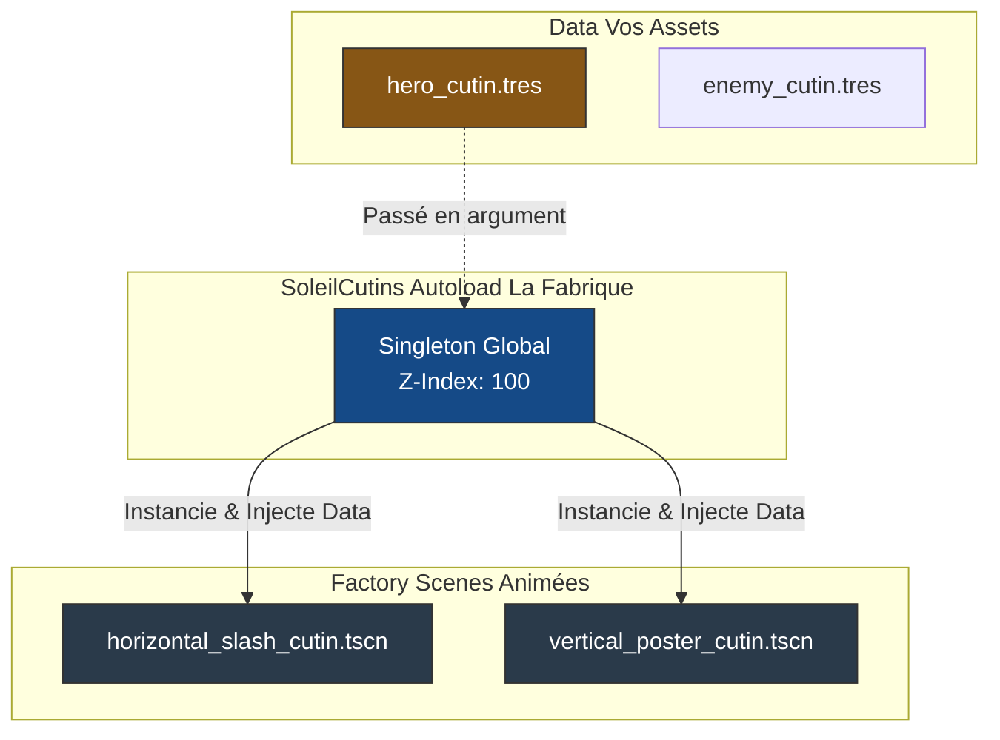

# Soleil Cut-in Module ⚡

Un module Godot 4 dédié à la création d'animations de superposition d'écran dramatiques (les fameux "Cut-ins", "Super Arts", ou "Screen Takeovers" très présents dans les JRPG et les jeux de combat visuellement intenses). 

Ce système est conçu avec la philosophie **Data-Driven** (Piloté par les données) pour garantir une réutilisation maximale sans dupliquer les scènes complexes d'animation.

## 🏗️ Architecture (Ressources + Fabriques)

Le module sépare strictement *l'Animation* (la scène générique programmée avec des courbes parfaites) des *Données* (les couleurs et le visage du personnage qui font l'attaque).



L'Autoload vit sur un `CanvasLayer` situé bien au-dessus de tout le reste du jeu, s'assurant que l'animation ne soit jamais dissimulée par une caméra de niveau ou l'interface standard.

---

## 📦 Installation (Git Submodule)

Installez ce module en tant que sous-module Git pour pouvoir bénéficier des ajouts de nouvelles animations de cut-in par la suite !

1. À la racine de votre projet Git, ouvrez un terminal et exécutez la commande suivante :
   ```bash
   git submodule add https://github.com/MarioTheKnight/soleil-cutin.git addons/soleil_cutin
   ```
2. Ouvrez votre projet dans l'éditeur Godot.
3. Allez dans **Projet > Paramètres du projet > Extensions (Plugins)**.
4. Cochez **Activé** à côté de "Soleil Cutins".
5. L'Autoload `SoleilCutins` sera automatiquement enregistré.

---

## 🎨 Utilisation depuis l'Éditeur (Créer une attaque)

Avant de coder quoi que ce soit, vous devez définir concrètement les visuels d'une attaque en créant une **Ressource** :

1. Dans votre dossier racine `assets/`, faites clic droit > **Créer un nouveau... > Ressource**.
2. Recherchez et choisissez le type **`CutinData`**.
3. Nommez-le (ex: `hero_fireball.tres`).
4. Dans l'inspecteur à droite, glissez-déposez le portrait dessiné du héros, choisissez la couleur de fond du bandeau (ex: Rouge), la couleur du texte et tapez le nom de l'attaque.

*C'est fini pour la partie artistique ! Vous pouvez créer 50 .tres différents pour vos 50 personnages sans avoir besoin d'assembler la moindre scène.*

---

## 💻 Utilisation Programatique (GDScript)

Une fois vos fichiers `.tres` préparés, l'invocation se fait en une seule ligne depuis le code de combat de votre jeu !

### Invoquer un Cut-in

1. Pointez vers votre ressource `.tres` d'une façon ou d'une autre (exposée ou pré-chargée).
2. Appelez `SoleilCutins.play_cutin(...)` en passant le style d'animation désiré et les données.

```gdscript
extends CharacterBody2D

# 1. Le Game Designer glisse `hero_fireball.tres` dans l'inspecteur ici !
@export var my_special_attack_data: CutinData 

func use_ultimate_skill():
    # 2. On lance l'animation par-dessus l'écran
    #    ("horizontal_slash" ou "vertical_poster")
    SoleilCutins.play_cutin("horizontal_slash", my_special_attack_data)
    
    # ...
    # Insérez ici la logique du jeu (figer le temps, infliger des dégâts)
    print("Dégâts massifs infligés !")
```

### 🎬 Cut-ins Animés & Vidéo 🎥

Pour plus de dynamisme, vous pouvez utiliser des animations de sprites ou des vidéos :

#### Animation de Sprites (`SpriteFrames`)
1. Dans votre `CutinData`, remplissez le champ **Animated Portrait**.
2. Appelez `play_cutin` avec le template `"animated_horizontal_slash"`.
3. Le système jouera l'animation `"default"` pendant le mouvement, et déclenchera l'animation `"slash"` au moment de l'impact !

#### Vidéo (`VideoStream`)
1. Remplissez le champ **Video Portrait** avec un fichier (recommandé: **.ogv**).
2. Utilisez le template `"video_horizontal_slash"`.
3. La vidéo est automatiquement **clippée** (masquée) pour rester à l'intérieur du bandeau horizontal.

> **🔥 Pro-Tip : Intégration SoleilMotion**
> Si le plugin `soleil_motion` est également installé et actif sur votre projet, les cut-ins secoueront la caméra (`Camera2D`) active du viewport de manière intense lors de certains moments clés de l'animation ! L'intégration est automatique.

---

## 🛠️ Extensibilité (Templates sur-mesure)

Si la forme des templates inclus (bandeau horizontal, poster vertical) ne vous convient pas, vous pouvez **créer vos propres scènes de Cut-in** dans les dossiers de votre jeu, sans jamais modifier le code du module !

Votre scène personnalisée doit simplement :
1. Être un `Control` (pour prendre tout l'écran).
2. Avoir un script avec une fonction `setup_cutin(data: CutinData)`.
3. Gérer elle-même son animation (ex: via un `Tween`) et appeler `queue_free()` à la fin.

### Méthode 1 : Enregistrement Global
Idéal si vous réutilisez souvent le même template personnalisé.

```gdscript
# Au lancement du jeu (ex: _ready d'une scène globale)
SoleilCutins.register_template("shattered_glass", preload("res://assets/cutins/shattered_glass_cutin.tscn"))

# Plus tard dans les combats...
SoleilCutins.play_cutin("shattered_glass", my_data)
```

### Méthode 2 : Lancement Direct
Utile pour un cut-in unique (ex: l'attaque ultime du Boss de fin) défini spécifiquement pour une scène.

```gdscript
@export var boss_cutin_scene: PackedScene
@export var boss_cutin_data: CutinData

func trigger_boss_ultimate():
    SoleilCutins.play_custom_cutin(boss_cutin_scene, boss_cutin_data)
```

---

## 📂 Organisation Recommandée des Fichiers

```text
MonSuperJeu/
├── addons/
│   ├── soleil_cutin/       <-- Le code et les scènes complexes (ne pas toucher)
│   └── soleil_motion/
├── assets/
│   ├── characters/
│   │   ├── hero/
│   │   │   ├── hero_sprite.png
│   │   │   ├── hero_portrait_huge.png    <-- Pour la ressource
│   │   │   └── hero_cutin_style1.tres    <-- La ressource CutinData
│   │   └── boss/
│   │       ├── boss_sprite.png
│   │       ├── boss_angry_portrait.png   <-- Pour la ressource
│   │       └��─ boss_cutin_phase2.tres    <-- La ressource CutinData
```

---

## Reference

### Resource CutinData

| Propriete | Type | Defaut | Description |
|-----------|------|--------|-------------|
| `character_portrait` | `Texture2D` | `null` | Image statique du personnage |
| `animated_portrait` | `SpriteFrames` | `null` | Animation de sprites (remplace le portrait statique) |
| `video_portrait` | `VideoStream` | `null` | Video (remplace portrait statique et anime) |
| `background_color` | `Color` | `(0.1, 0.1, 0.1, 1.0)` | Couleur du bandeau |
| `fx_color` | `Color` | `WHITE` | Couleur du texte et des effets |
| `title_text` | `String` | `"Special Attack"` | Nom de l'attaque affiche |

### Templates inclus

| ID | Description |
|----|-------------|
| `"horizontal_slash"` | Bandeau horizontal classique |
| `"vertical_poster"` | Poster vertical plein ecran |
| `"animated_horizontal_slash"` | Bandeau horizontal avec SpriteFrames |
| `"video_horizontal_slash"` | Bandeau horizontal avec lecture video |

### Methodes

| Methode | Description |
|---------|-------------|
| `play_cutin(template_id: String, data: CutinData)` | Lance un cut-in avec un template enregistre |
| `play_custom_cutin(cutin_scene: PackedScene, data: CutinData)` | Lance un cut-in avec une scene personnalisee |
| `register_template(template_id: String, template_scene: PackedScene)` | Enregistre un template custom |

### Signaux

Aucun signal public. Les templates gèrent leur cycle de vie en interne (`queue_free()` a la fin).

### Dependances

| Module | Requis ? | Integration |
|--------|----------|-------------|
| `soleil_motion` | non | Si present : camera shake automatique sur les moments d'impact des cut-ins |
